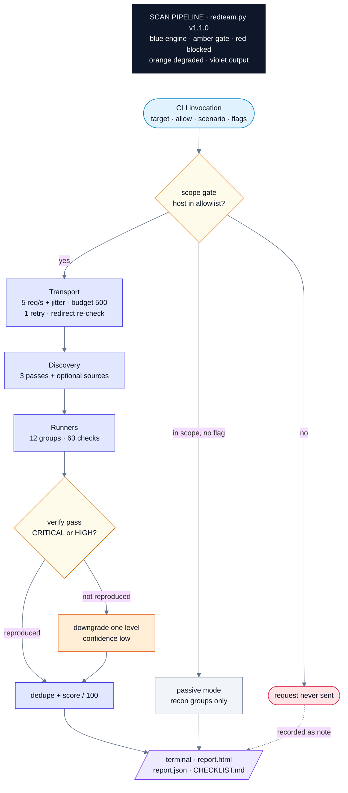
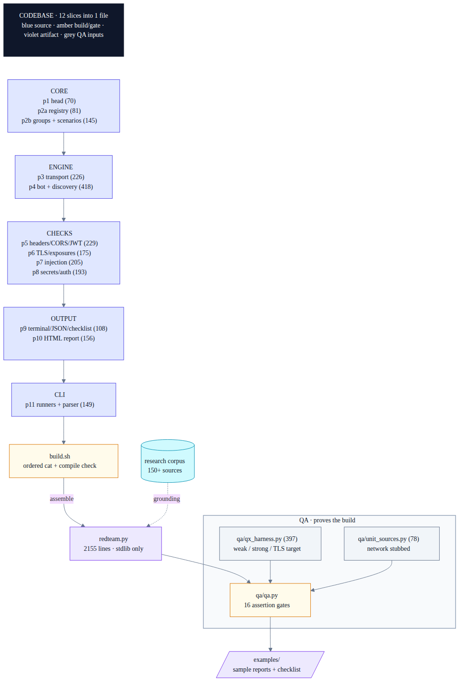

# 👑 REDQUEEN

<p align="center">
  <b>An authorized red team simulator for websites YOU own.</b><br>
  It attacks your site exactly like an outsider would, then hands you a tick-box
  checklist with the literal fix for every hole.
</p>

```
   ____        _____                     _       ____                  _
  |  _ \  __ _|  ___|__  _ __ ___  _ __ | | __  |  _ \ ___  _   _ _ __ | |_ ___ _ __
  | | | |/ _` | |_ / _ \| '_ ` _ \| '_ \| |/ /  | |_/ / _ \| | | | '_ \| __/ _ \ '__|
  | |_| | (_| |  _| (_) | | | | | | |_) |   <   |  _ < (_) | |_| | | | | ||  __/ |
  |____/ \__,_|_|  \___/|_| |_| |_|_.__/|_|\_\  |_| \_\___/ \__,_|_| |_|\__\___|_|
  ┌──────────────────────────────────────────────────────────────────────────────┐
  │ scope gate ► crawl ► JS mining ► 63 probes ► re-verify ► score ► CHECKLIST   │
  └──────────────────────────────────────────────────────────────────────────────┘
```

<p align="center">
  
  
  
  
  
  
  
</p>

> "It takes all the running you can do, to keep in the same place."
> The Red Queen was right: security is not a state, it is a race. This bot is
> your treadmill: run it, fix what it finds, run it again, stay ahead.

---

## 🧭 Contents

[⚡ 60-second start](#-60-second-start) ·
[🗺️ How it works](#-how-it-works) ·
[🖼️ Diagrams](#-diagrams) ·
[🛡️ Safety rails](#-safety-rails) ·
[🗂️ Scenarios](#-scenarios) ·
[🕵️ The 63 checks](#-the-63-checks) ·
[🕸️ Recon powers](#-recon-powers) ·
[📊 Outputs](#-outputs) ·
[✅ Proof](#-proof) ·
[🔧 Extend it](#-extend-it) ·
[❓ FAQ](#-faq) ·
[⚖️ Ethics](#-ethics)

---

## ⚡ 60-second start

- [ ] Clone the repo (it is private, you are the owner)
- [ ] Pick your domain and confirm in writing that you own it
- [ ] Run a gentle recon first, read the report
- [ ] Run the full simulation off-peak
- [ ] Work down `CHECKLIST.md`, re-run, watch the score climb

```bash
# gentle first pass: recon only, no active probing, no ownership flag needed
python3 redteam.py --target https://yourdomain.example --allow yourdomain.example

# full attack simulation
python3 redteam.py --target https://yourdomain.example --allow yourdomain.example --i-own-this

# everything, plus historical URLs and subdomain takeover leads
python3 redteam.py --target https://yourdomain.example --allow yourdomain.example --i-own-this --wayback --ct-log
```

Exit codes are CI-ready: `2` critical found, `1` high found, `0` clean.

---

## 🗺️ How it works

One scan, start to finish. The scope gate decides everything before a single
packet leaves your machine, and the report ships even if the scan stops early.



The discovery engine is three passes: a robots-aware crawl, then it downloads
your JavaScript bundles and mines them for hidden `/api/` routes, then it
probes those routes. Optional `--wayback` and `--ct-log` feed it historical
and certificate-transparency targets (read-only, scope-filtered).

---

## 🖼️ Diagrams

Six focused diagrams, rendered images, Mermaid source in each `.mmd`:

| # | Diagram | What it shows |
|---|---------|---------------|
| 1 | [Run flow](docs/diagrams/01-run-flow.png) | what happens when you execute one scan |
| 2 | [Discovery engine](docs/diagrams/02-discovery-engine.png) | 3 crawl passes + passive sources |
| 3 | [Codebase](docs/diagrams/03-codebase.png) | 12 build slices into one file, QA feeding examples |
| 4 | [Check engine](docs/diagrams/04-check-engine.png) | registry, groups, scenarios, verify, score |
| 5 | [Safety rails](docs/diagrams/05-safety-rails.png) | the gates every request passes, forbidden payloads |
| 6 | [QA loop](docs/diagrams/06-qa-loop.png) | harness modes into 16 assertion gates |

Premium view: **[docs/ARCHITECTURE.html](docs/ARCHITECTURE.html)**, a
graphite + amber dossier with six hand-built SVG figures (title strips,
leader-line annotations, Archivo + JetBrains Mono). Built by
`docs/build-arch-html.py`, QA-gated with ui-gate (exit 0).

Mermaid sources + PNG renders: [docs/ARCHITECTURE.md](docs/ARCHITECTURE.md).

| The codebase, in one picture |
|---|
|  |

---

## 🛡️ Safety rails

Built into the engine, not into the documentation.

| Rail | Behavior |
|---|---|
| Scope gate | every attack-path host must match `--allow`, out-of-scope = never sent |
| Ownership | active checks require `--i-own-this`, otherwise passive recon only |
| Rate limit | 5 req/s with jitter, hard request budget (default 500) |
| Payload policy | canaries, error signatures, echo markers. No floods, no brute force, no data writes, ever |
| Private IPs | refused unless `--local` (127.0.0.1 only) |
| Identity | User-Agent announces `placeholder_websiteRedTeamBot/1.0 (authorized self-testing)` |
| robots.txt | honored during discovery (`--ignore-robots` overrides, logged in report) |
| External sources | Wayback / crt.sh / Cert Spotter only via `--wayback` / `--ct-log`, GET-only, read-only |
| Failure handling | a crashing check degrades to a note, the report still ships |

---

## 🗂️ Scenarios

| Scenario | What runs |
|---|---|
| `recon` | robots/sitemap crawl, security.txt, JS asset mining |
| `headers` | TLS + security headers + host-header poisoning + CORS + cookies |
| `misconfig` | exposed files, GraphQL introspection, directory listing, stack traces, HTTP methods |
| `injection` | XSS, SQLi (error + boolean differential), command injection, traversal, open redirect |
| `auth` | admin/authz force-browsing, CSRF posture, login rate limit, JWT checks, dangling subdomains |
| `api` | recon + exposures + CORS + injection (API-focused sweep) |
| `full` | everything (default) |

---

## 🕵️ The 63 checks

Severity legend:

| badge | severity | weight in score |
|---|---|---|
|  | immediate compromise path | minus 25 |
|  | serious, exploitable | minus 12 |
|  | real weakness, needs conditions | minus 5 |
|  | hardening gap | minus 2 |
|  | observation | free |

<details>
<summary><b>🔐 Headers and framing (13 checks)</b></summary>

- HSTS missing · CSP missing · CSP allows unsafe-inline/eval
- X-Content-Type-Options missing · Referrer-Policy missing
- Permissions-Policy missing · X-XSS-Protection legacy value
- Expect-CT or HPKP present (obsolete) · COOP missing · CORP missing
- X-Powered-By leak
- sensitive pages cacheable · clickjacking (frameable pages)
</details>

<details>
<summary><b>🌐 CORS and transport (7 checks)</b></summary>

- arbitrary Origin reflection (escalates with credentials) · null origin trusted
- wildcard CORS on authenticated endpoints · plain HTTP served
- legacy TLS 1.0/1.1 accepted · certificate expiring soon
- certificate untrusted or hostname mismatch
</details>

<details>
<summary><b>🍪 Session and JWT (10 checks)</b></summary>

- cookie missing Secure · missing HttpOnly · missing SameSite
- SameSite=None without Secure · session cookie over plain HTTP
- cookie lives for months · JWT alg=none
- JWT signed with a guessable secret (offline cracking, no login attempts)
- JWT without exp · JWT exp too long
</details>

<details>
<summary><b>🔑 Secrets (1 check, 8 patterns)</b></summary>

AWS access keys, Stripe live secrets, GitHub tokens, OpenAI-style keys,
embedded private keys, Slack tokens, bearer credentials, Google API keys,
scanned across HTML and mined JavaScript. Values are redacted in reports,
never printed.
</details>

<details>
<summary><b>💾 Exposures (14 checks)</b></summary>

- .git/HEAD and .git/config · .env · .env.local/.env.production
- backup archives (zip/tar/sql magic) · config files · dependency manifests
- .aws/credentials · private keys (id_rsa)
- OpenAPI / Swagger / api-docs exposed
- admin panels: phpMyAdmin, Adminer, Tomcat manager
- actuator / phpinfo / server-status / pprof debug endpoints
- source maps published · directory listing · stack traces on errors
- GraphQL introspection enabled
</details>

<details>
<summary><b>💉 Injection (6 checks)</b></summary>

- reflected XSS (unique canary, context-aware confirmation)
- SQL injection via database error signatures
- SQL injection via boolean differential (AND 1=1 vs AND 1=2, normalized compare)
- OS command injection (benign echo marker only)
- path traversal (planted canary file, or opt-in `--deep-traversal`)
- open redirect (scheme-relative payloads)
</details>

<details>
<summary><b>🛡️ AuthZ and abuse (5 checks)</b></summary>

- admin and authenticated surfaces reachable without login
- CSRF token missing on state-changing forms
- no rate limit observed on login (gentle burst of 10, expects 429)
- Host / X-Forwarded-Host poisoning (password-reset links)
- certificate-log subdomain that no longer resolves (takeover candidate, report only)
</details>

<details>
<summary><b>🧩 Client, methods and recon (7 checks)</b></summary>

- third-party script without Subresource Integrity
- mixed content on HTTPS pages · HTTP TRACE enabled
- PUT/DELETE accepted at the edge · server version disclosed in banner
- security.txt missing (RFC 9116) · robots.txt disclosure
</details>

Run `python3 redteam.py --list-checks` for the full machine-readable table
with severity, OWASP mapping and one-line fix per check.

---

## 🕸️ Recon powers

| Power | What it does |
|---|---|
| JS endpoint mining | fetches your same-origin bundles, extracts `fetch()` / `axios` / `/api/` routes and params, then probes them. SPAs cannot hide their API from the crawler |
| `--wayback` | historical URLs from the Wayback CDX API: dead admin panels, forgotten backups. Scope-filtered to your host |
| `--ct-log` | certificate transparency names (crt.sh, automatic Cert Spotter fallback), DNS-resolved to flag takeover candidates. Report only, never claims |
| sitemap + gzip | parses sitemap indexes, gzipped sitemaps, nested references |
| fingerprinting | server banners, framework headers, page titles, tech hints in the recon table |

Both external sources are GET-only, throttled, budgeted, and show their real
outcome in the report (including "0 found").

---

## 📊 Outputs

Every run produces four artifacts in `rt-report-<timestamp>/`:

| Artifact | What it is |
|---|---|
| terminal summary | severity table, score bar, attacker narrative, top-3 fixes |
| `report.html` | self-contained, severity filter buttons, evidence + exact fix per finding, OWASP mapping, coverage matrix, recon |
| `report.json` | machine-readable: findings, mined endpoints, recon, notes (CI friendly) |
| `CHECKLIST.md` | ordered tick boxes grouped by severity, each with its fix |

Try them without running a scan:
[sample vulnerable report](examples/sample-report-vulnerable.html) ·
[hardened report](examples/sample-report-hardened.html) ·
[sample checklist](examples/sample-CHECKLIST.md) ·
[sample JSON](examples/sample-report.json)

---

## ✅ Proof

Not claims, assertions:

```bash
python3 qa/qa.py
```

| Gate family | What it proves |
|---|---|
| weak target | all 47 expected checks fire, 0 unexpected, 54 findings, 7 critical, score 0/100 |
| JS mining | both hidden API routes recovered from the bundle |
| artifacts | checklist written with 54 items, JSON has mined endpoints |
| strong target | hardened server scores 76/100 with only the 2 unavoidable HTTP residuals |
| passive mode | without `--i-own-this` zero active probes are sent |
| https target | HSTS, Secure-flag, certificate expiry and trust checks fire |
| unit gate | wayback scope filtering, CT dangling detection, Cert Spotter fallback (network stubbed) |
| CLI guards | `--list-checks`, missing `--allow` refusal, IP-literal refusal |

Last run: **16/16 gates PASS, exit 0**.

---

## 🔧 Extend it

Adding a check is a four-step loop:

1. `parts/p2_checks_b.py` → add the registry entry
   (`"my-check": ("A02", "MEDIUM", "Title", "attacker win", "exact fix")`)
   and add the id to its `GROUPS` list.
2. `parts/p6_*.py` / `parts/p7_*.py` → write `check_mything(bot)` using
   `bot.get()` and `bot.add()` (copy `check_graphql`, it is 15 lines).
3. `parts/p11_main.py` → append it to the right `RUNNERS` group.
4. Rebuild and prove nothing broke:

```bash
./build.sh && python3 qa/qa.py
```

> ⚠️ Never `cat parts/*.py > redteam.py`: shell glob sorts `p10` before
> `p1_head` and the file assembles broken. `build.sh` uses the correct order.

For every new check, add one weak-harness endpoint and one `EXPECT` line in
`qa/qa.py`, so your feature ships proven like the other 63.

---

## 🧠 Go deeper

The bot proves, it never breaks. The manual layer that completes it:

- **Two-account IDOR**: register two test users, swap object ids between
  sessions, compare responses.
- **CSRF replay**: copy a state-changing request as cURL, strip the token,
  replay. Rejection means you are covered.
- **Business logic**: negative quantities, coupon reuse, price tampering in
  DevTools, skipped workflow steps.
- **Stored XSS**: post an `onerror` payload through every input of a test
  account, check in a second browser.
- **Complementary scanners** (safe flags, own site only): `nuclei` with
  exposure/misconfig templates at `-rate-limit 5`, ZAP baseline mode
  (passive), `testssl.sh --rating-only`, `npm audit`, `osv-scanner`,
  `gitleaks` for git history.
- **External grades**: [securityheaders.com](https://securityheaders.com),
  [Mozilla Observatory](https://observatory.mozilla.org),
  [SSL Labs](https://www.ssllabs.com/ssltest/).

---

## ❓ FAQ

<details>
<summary><b>Is it safe to run against production?</b></summary>

Yes, with manners: default 5 req/s, a hard request budget, robots.txt
respect, benign payloads only. Start with `--scenario recon` off-peak, then
`full`. It never writes data, never guesses passwords, never floods.
</details>

<details>
<summary><b>Why did my score come out low?</b></summary>

The score starts at 100 and subtracts weighted severities (critical 25,
high 12, medium 5, low 2). Unverified criticals count half. Fix findings,
re-run, the bar climbs. It is a progress meter, not a grade.
</details>

<details>
<summary><b>Does it exploit what it finds?</b></summary>

No. It proves with canaries, error signatures and echo markers, then stops.
Every critical/high finding is re-tested once before it counts; anything not
reproducible is downgraded to candidate instead of shouted about.
</details>

<details>
<summary><b>Can it test my login area / APIs?</b></summary>

Pass a session with `--cookie 'session=...'` for authenticated checks, use
`--scenario api` for API-first sweeps, and let JS mining discover routes the
crawler cannot see. Two-account IDOR and business logic remain manual on
purpose.
</details>

<details>
<summary><b>What about dependencies and CVEs?</b></summary>

It reports what your server and bundles disclose (versions, manifests,
banners). Matching those against CVEs is a deliberate manual step:
`npm audit`, `osv-scanner -r .`, then patch. Supply chain is A03:2025 and
black-box scanners cannot prove it alone.
</details>

---

## ⚖️ Ethics

Only run this against sites you own or have written authorization to test.
The tool is built defensively: scope gate first, read-only external sources,
no destructive payload classes implemented at all. Automated coverage is a
subset of a real assessment: finish with manual access-control,
business-logic and abuse-case testing, then harden (headers from the fixes,
dependency scanning in CI, WAF and rate limits, alerting, backups you have
restored once).

---

<p align="center">
  <b>redteam.py v1.1.0</b> · 2,155 lines · stdlib only · 63 checks · 16/16 QA gates<br>
  built on OWASP Top 10:2025, OWASP WSTG, OWASP Cheat Sheets, PortSwigger Academy,
  NIST SP 800-115, PTES
</p>
