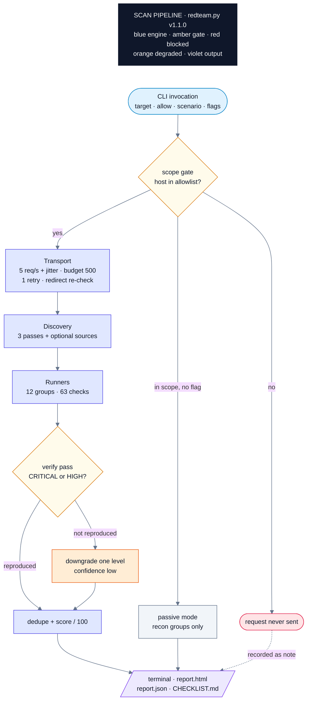
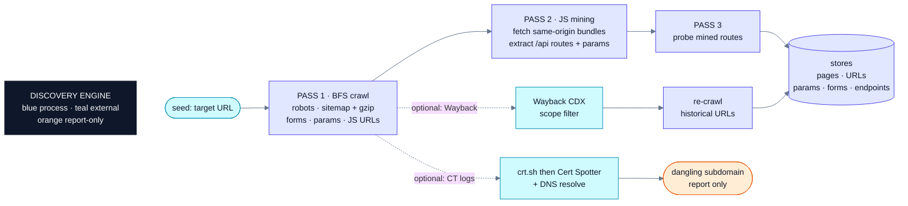
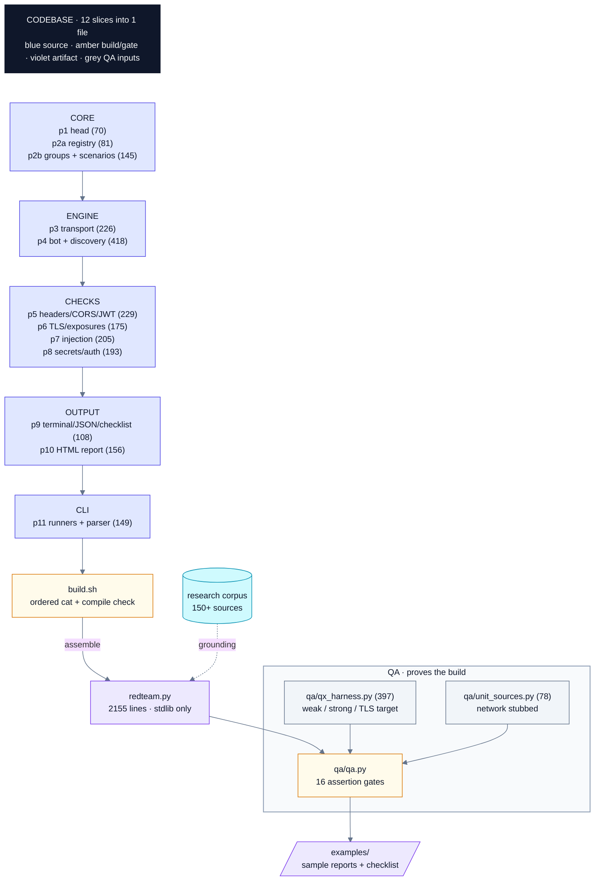
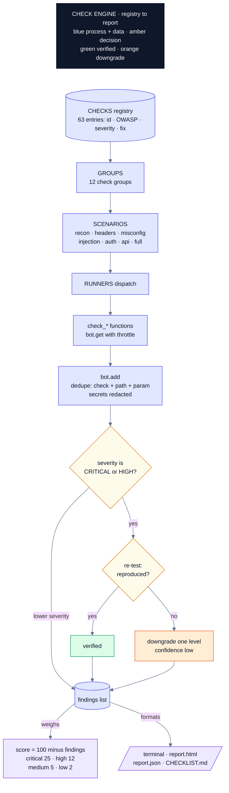
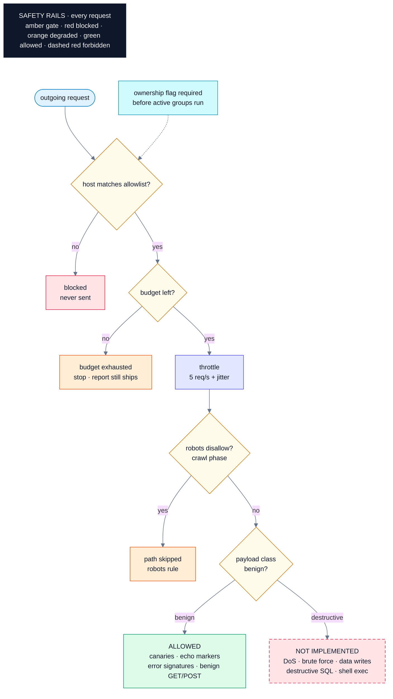
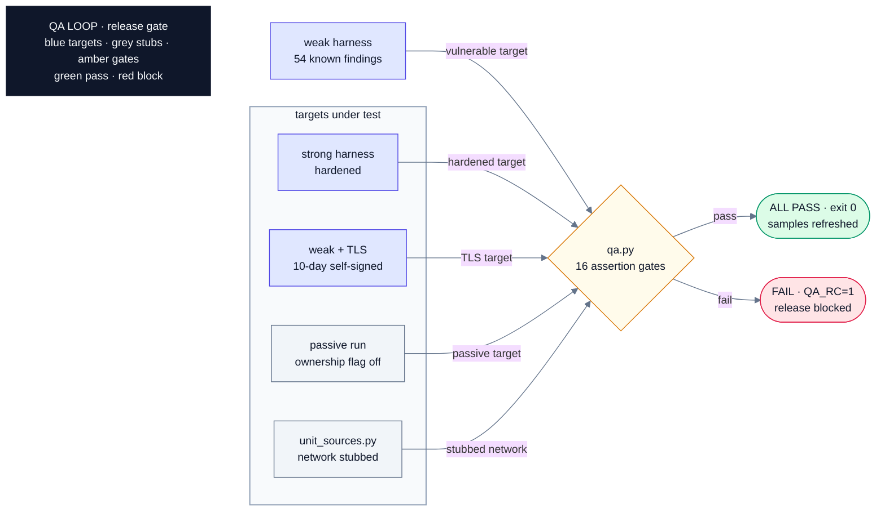

# redteam.py v1.1.0 · Architecture

How the bot works and how its codebase is put together. Six focused diagrams,
each with one claim.

Color legend used everywhere: blue = engine, amber = gate or decision,
green = allowed / pass, red = blocked, orange = degraded path, violet =
artifact, sky blue = external source, dashed red = forbidden class.

Rendered PNGs live in `diagrams/` (Mermaid source in each `diagrams/*.mmd`,
re-render with `sh docs/render.sh`).

## 1. Run flow · what happens when you execute one scan

Scope gate first, reports always ship, even on early stop.

## 2. Discovery engine · how it finds pages, APIs and secrets to probe

Three crawl passes, then optional passive sources; every input lands in the
same stores the checks read from.

## 3. Codebase · 12 build slices assemble into one dependency-free file

| Layer | Files | Lines |
|---|---|---|
| Core | p1 head (70), p2a registry (81), p2b groups + scenarios (145) | 296 |
| Engine | p3 transport (226), p4 bot + discovery (418) | 644 |
| Checks | p5 headers/CORS/JWT (229), p6 TLS/exposures (175), p7 injection (205), p8 secrets/auth (193) | 802 |
| Output | p9 terminal/JSON/checklist (108), p10 HTML report (156) | 264 |
| CLI | p11 runners + parser (149) | 149 |
| **Assembled** | **redteam.py** | **2155** |

## 4. Check engine · how one check becomes a verified finding

Registry drives everything: groups, severities, OWASP mapping and fixes.

## 5. Safety rails · why the bot cannot wander off or hurt your site

Every request passes the gates in order; forbidden payload classes are not
implemented at all.

## 6. QA proof loop · how every change is proven before it ships

