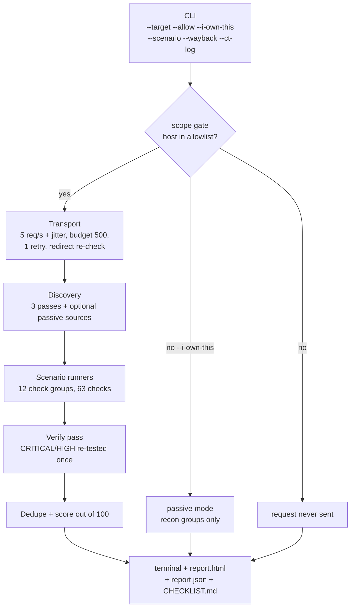
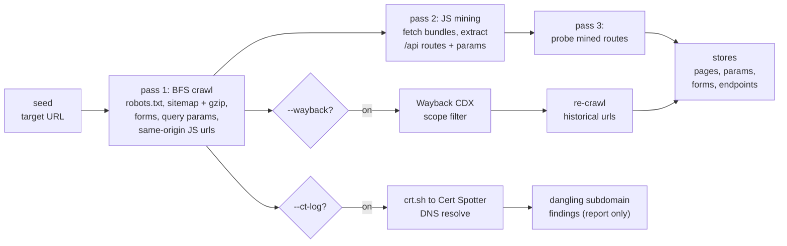
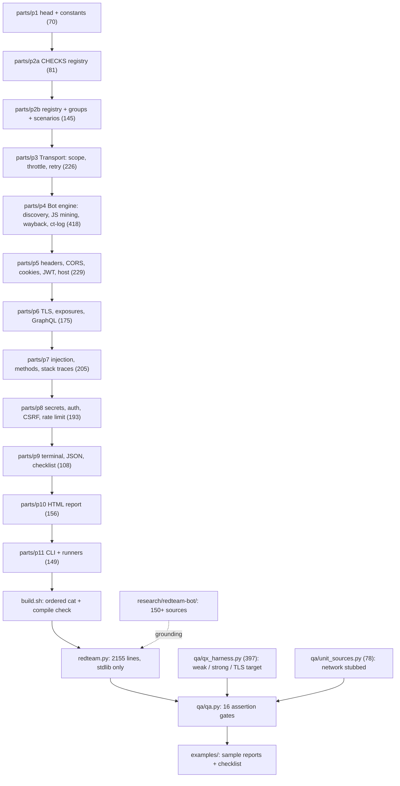
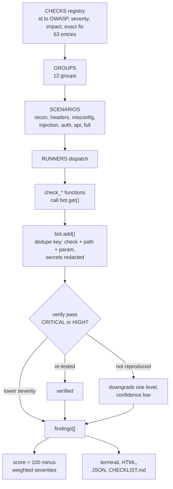
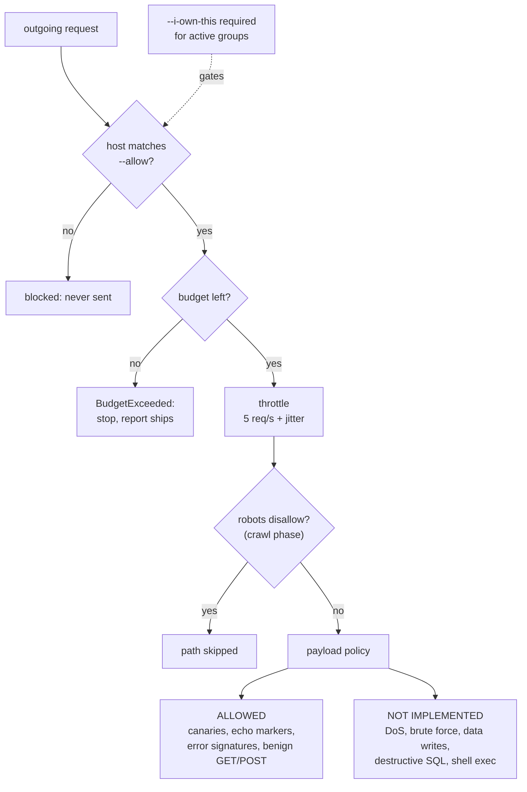
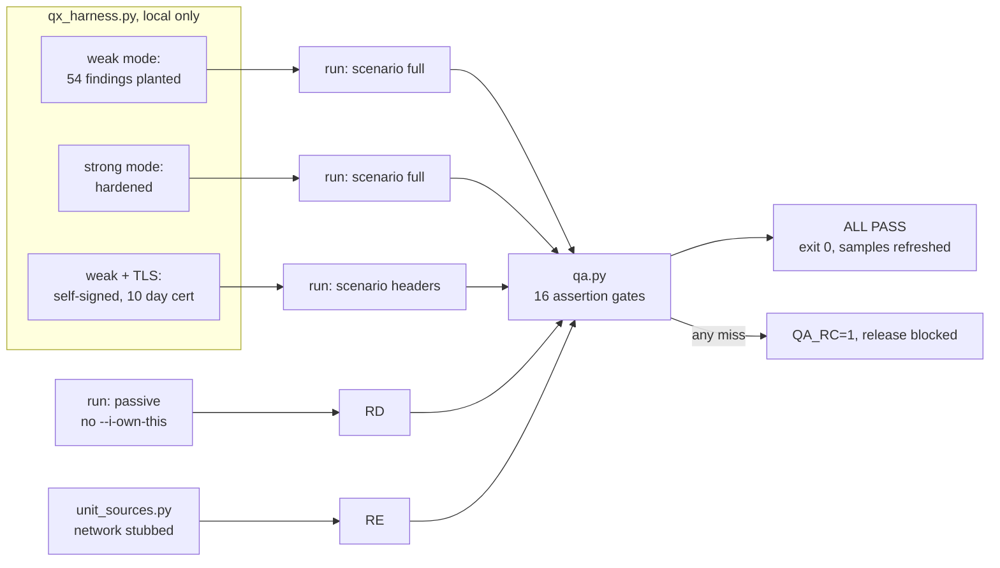

# redteam.py v1.1.0 · Architecture

How the bot works and how its codebase is put together. Six focused diagrams,
each with one claim. Rendered PNGs live in `diagrams/` (Mermaid source in each
`diagrams/*.mmd`).

## 1. Run flow · what happens when you execute one scan

Scope gate first, reports always ship, even on early stop.

## 2. Discovery engine · how it finds pages, APIs and secrets to probe

Three crawl passes, then optional passive sources; every input lands in the
same stores the checks read from.

## 3. Codebase · 12 build slices assemble into one dependency-free file

## 4. Check engine · how one check becomes a verified finding

Registry drives everything: groups, severities, OWASP mapping and fixes.

## 5. Safety rails · why the bot cannot wander off or hurt your site

Every request passes the gates in order; forbidden payload classes are not
implemented at all.

## 6. QA proof loop · how every change is proven before it ships

